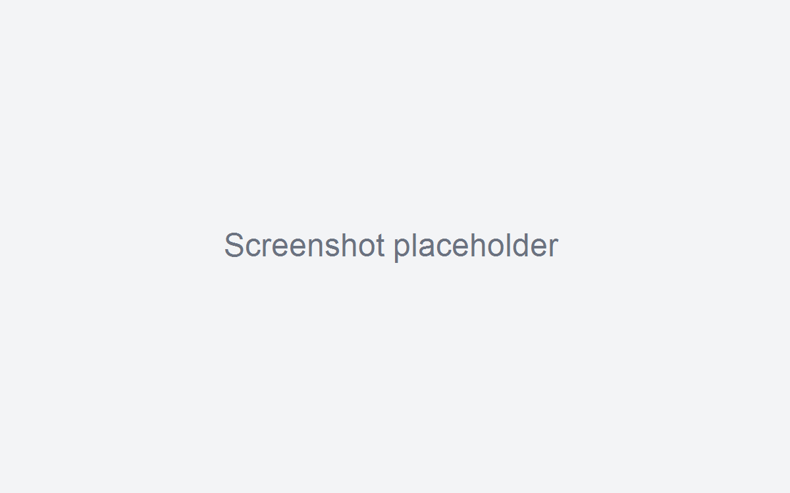

# TaskDesk

Registro attivita smart, local-first, per ricostruire le attivita da riportare nel Gestore. Non e un tool di fatturazione: qui conta la chiarezza e la credibilita di Giorno/Settimana/Mese.

## Per chi e
- Consulenti e team piccoli che compilano un Gestore a fine mese.
- Chi vuole una vista chiara dei gap, senza inventare nulla.

## Installazione
- Scarica l'ultima release da GitHub Releases.
- Installa l'app (Windows/macOS) e avviala.

## Uso in 2 minuti
1. Apri TaskDesk e crea una nuova attivita con il pulsante "+ Nuova attivita".
2. Compila titolo, cliente, minuti e stato (Bozza/Inserita).
3. Vai su "Mese" per il colpo d'occhio: gap, giorni incompleti, top clienti.
4. Esporta il mese in XLSX e copia il formato Gestore.

## Funzioni principali
- CRUD attivita con quick-add, inline edit, duplicazione.
- Viste Giorno/Settimana/Mese con gap e smart grouping.
- Preset riutilizzabili e clienti con import CSV.
- Export XLSX + copia formato Gestore.
- Backup con rotazione e ripristino guidato.
- Tray, menu app, hotkey globale e temi light/dark/system.

## Privacy
Dati locali, zero cloud. Il database vive in `app.getPath('userData')`.

## Sviluppo
Documentazione tecnica in `docs/dev/DEV_SETUP.md`.

## Licenza
MIT
